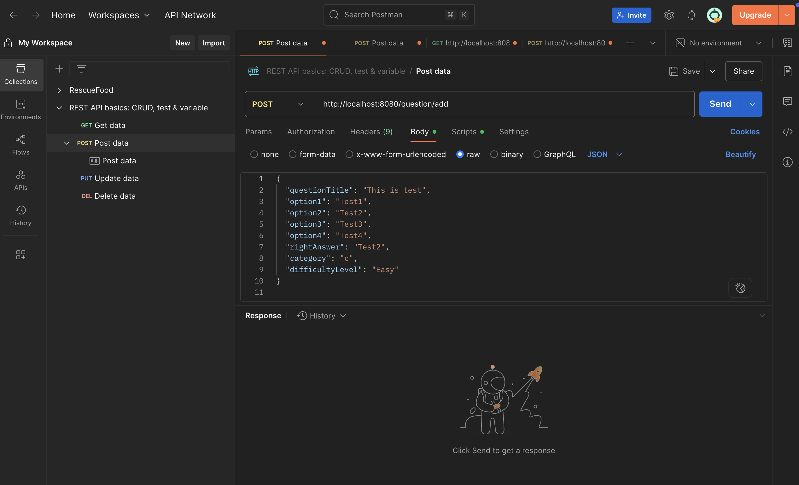
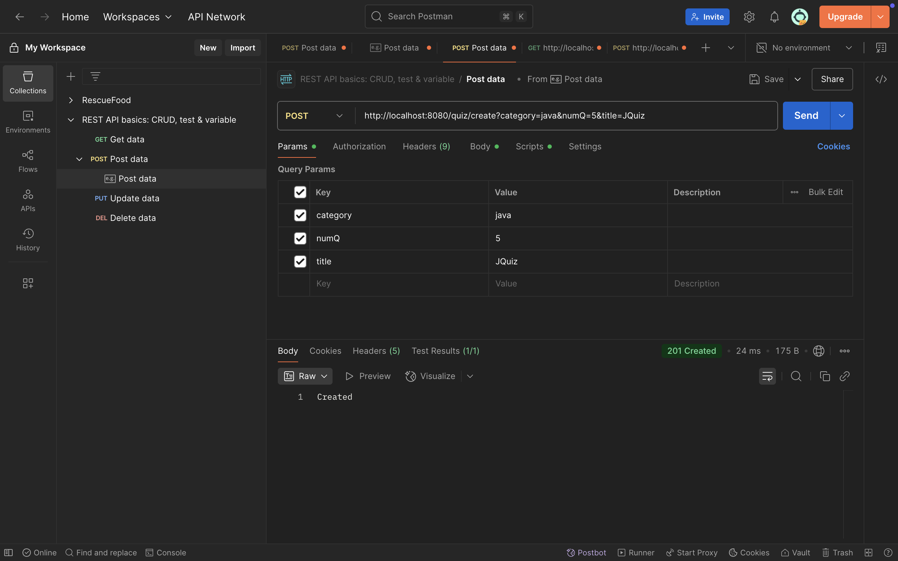
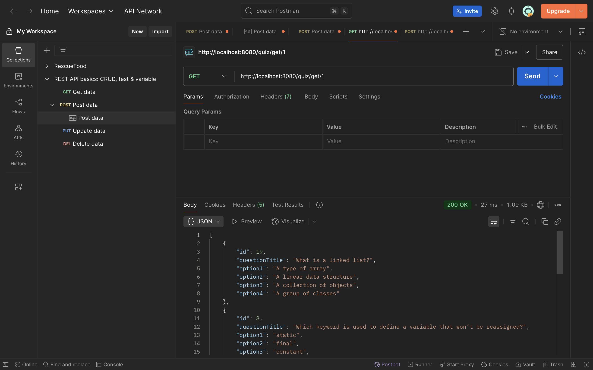
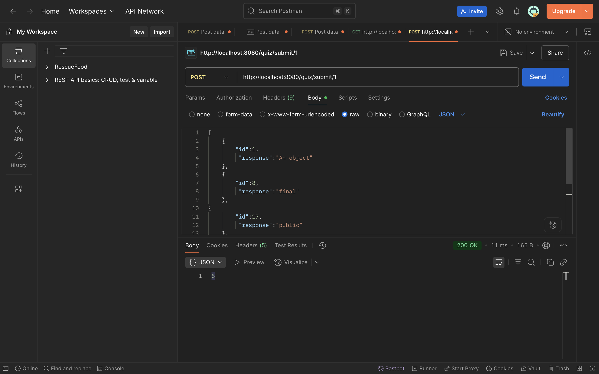

# 📘 Quiz Backend API

This is a backend project for a **Quiz Application**, built using **Java Spring Boot** and **PostgreSQL**.

It provides RESTful APIs for managing quizzes, questions, and user responses, and includes scoring logic based on user answers.

---

## 🚀 Features

- Create and manage quizzes and questions
- Submit user responses and calculate score
- Spring Boot REST API architecture
- PostgreSQL for persistent data storage
- Error handling and response validation

---

## 🛠️ Tech Stack

- **Java 17+**
- **Spring Boot**
- **Spring Data JPA**
- **PostgreSQL**
- **Maven**

---

## 📸 Screenshot

 
 

 
 

 
 

 
 
